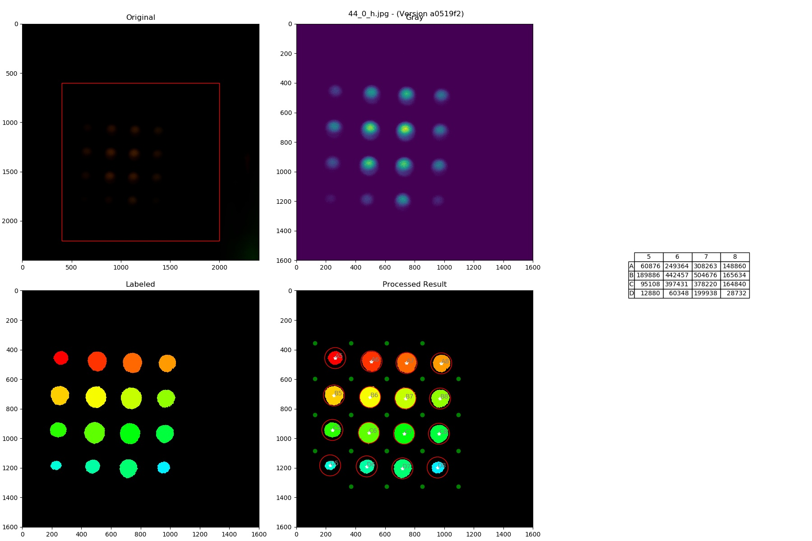

# PIX2RFU

## How to use
### 1. Make Datasheet in CFX96 format from the real-time PCR images.
To create a datasheet from entire images
```
$ activate rfu
$ cd rfu
$ python pix2rfu_32well.py "F:/path to experiment directory"
```
It will create `DSP_datasheet` folder in the experiment path, and save datasheets according to the CFX96 format.

if there are missing columns or rows
```
$ python pix2rfu_32well.py "F:/path to experiment directory" -c <numbers of missing cols> -r <numbers of missing rows>
```
Note: Numbers of missing cols and rows must be typed without spaces

### 2. Get image processing result from an image

To look into the image processing result
```
$ python pix2rfu_32well.py "F:/path to experiment directory" i <temp> <dye> <cycle> <well>
```
where `temp` is Low or High, `dye` is one of `['f', 'h', 'c', 'q6', 'q7']`, well is well name such as A1 and b3, and cycle is a number between 1 and TC (total cycle).

Intended Value | Valid Input
---------------|-------------
Low Temperature (QuantStep60) | `low`, `Low`
High Temperature (QuantStep72) | `high`, `High`
FAM | `f`
HEX | `h`
Cal Red 610 | `c`
Quasar 670 | `q6`
Quasar 705 | `q7`
Well name | `A1`, `a1`, `a01`, `A01`
Cycle number | Any number from 1 to total cycle. e.g. `2`

This will produce the following image.

It is composed of 4 images, and one data table.
  * Original: the original image from camera with cropping area as a red rectangle
  * Gray: the 2D density plot from cropped image with sum of RGB
  * Labeled: the image of labeled objects after image processing the gray image
  * Processed Result: the result image with objects with well location
  * Data table: table of RFU values, which are sum of RGB, corresponding to their well location

**It will be more helpful to identify causes of issues if you are attaching these images as posting a new issue**

## Requirements
### Environment
- Python 3.5.3
- Conda
- git

### Installation with virtual environment (Windows)
```
$ git clone https://github.com/ympaik87/rfu.git
$ conda create -n rfu python=3.5.3
$ activate rfu
$ cd rfu
$ pip install -r requirements.txt
```

### To update the code
```
$ git pull
```
